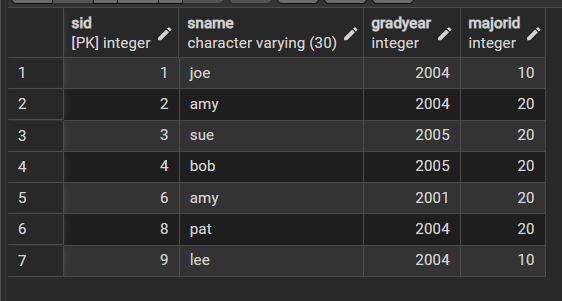
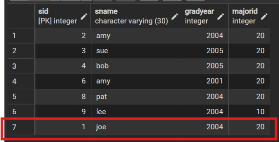
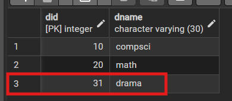
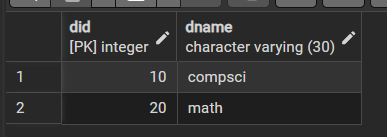
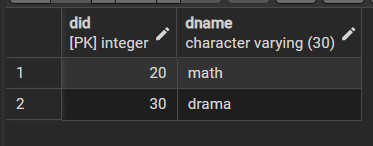
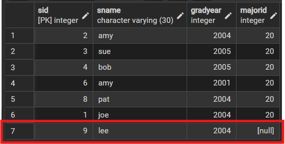
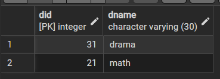
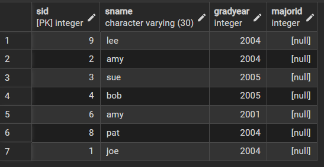
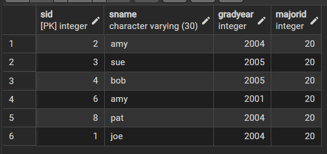
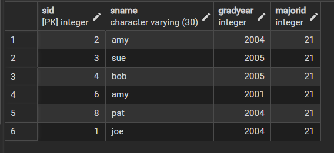

# Integrity Constraints 3 แบบ
## 1. no action
ต้องเพิ่ม ```CONSTRAINT```  ```no action``` ให้กับ student

```sql
ALTER TABLE student
DROP CONSTRAINT fk_student_dept;
```

```sql
ALTER TABLE demo.student
ADD CONSTRAINT fk_student_dept
FOREIGN KEY (majorid)
REFERENCES demo.dept(did)

ON DELETE NO ACTION
ON UPDATE NO ACTION;
``` 

### Table Student
1. Delete sid = 5,7
```sql
DELETE FROM student WHERE Sid IN (5,7);
SELECT * FROM student;
```

**Result** ลบข้อมูลในลูกได้


------

2. Try update sid =1 with majored = 40
```sql
UPDATE student  SET majorid = 40  WHERE sid = 1;
```
**Result** ทำไม่ได้เพราะพ่อมีแค่ 10, 20, 30
```
ERROR:  insert or update on table "student" violates foreign key constraint "fk_student_dept"
Key (majorid)=(40) is not present in table "dept". 

SQL state: 23503
Detail: Key (majorid)=(40) is not present in table "dept".
```
----------

3. Try update sid =1 with majored = 20
```sql
UPDATE student  SET majorid = 20  WHERE sid = 1;
SELECT * FROM student;
```

**Result** สามารถ update ได้


--------


### Table Dept
1. Delete : Did = 10
```sql
DELETE FROM dept WHERE did = 10;
```
**Result** delete ไม่ได้เพราะเชื่อมกับลูกอยู่
```
ERROR:  update or delete on table "dept" violates foreign key constraint "fk_student_dept" on table "student"
Key (did)=(10) is still referenced from table "student". 

SQL state: 23503
Detail: Key (did)=(10) is still referenced from table "student".
```
------------

2. Update :Did 30 ->31
```sql
UPDATE dept  SET did = 31 WHERE did = 30;
select * from dept;
```
**Result** update ได้เพราะ did 30 ไม่ได้เชื่อมอยู่กับลูก



3. Update Did 20->31
```sql
UPDATE dept  SET did = 21 WHERE did = 20;
```
**Result** update ไม่ได้เพราะเชื่อมกับลูกอยู่

4. Try delete did 31,20
```sql
-- DELETE FROM dept WHERE did = 31; /* ลบได้ */
-- DELETE FROM dept WHERE did = 21; 
-- DELETE FROM dept WHERE did = 20; /*ลบไม่ได้ */
-- SELECT * FROM dept;
SELECT * FROM student;
```
**Result** ถ้ามีการ update, delete ที่ fk กับลูกจะทำไม่ได้ แต่ถ้าไม่ได้ fk ก็จะทำได้ปกติ
- student ไม่มีอะไรเปลี่ยน


- dept did 31 drama ถูกลบออกไป




## 2. set null
### Table Student
> ต้อง ```DROP TABLE``` ทั้ง 2 แล้วสร้างใหม่เพื่อ reset
```sql
SET search_path TO demo;


CREATE TABLE dept (
    did   INTEGER PRIMARY KEY,
    dname VARCHAR(30) NOT NULL
);

INSERT INTO dept (did, dname) VALUES
(10, 'compsci'),
(20, 'math'),
(30, 'drama');


CREATE TABLE student (
    sid      INTEGER PRIMARY KEY,
    sname    VARCHAR(30) NOT NULL,
    gradyear INTEGER NOT NULL,
    majorid  INTEGER ,

    CONSTRAINT chk_gradyear_gt_2000
        CHECK (gradyear > 2000),

    CONSTRAINT fk_student_dept
        FOREIGN KEY (majorid)
        REFERENCES dept(did)
        ON DELETE SET NULL
        ON UPDATE SET NULL
);


INSERT INTO student (sid, sname, gradyear, majorid) VALUES
(1, 'joe', 2004, 10),
(2, 'amy', 2004, 20),
(3, 'sue', 2005, 20),
(4, 'bob', 2005, 20),
(5, 'kim', 2003, 30),
(6, 'amy', 2001, 20),
(7, 'art', 2004, 30),
(8, 'pat', 2004, 20),
(9, 'lee', 2004, 10);
```

1. Delete sid = 5,7

    **Result** Delete ได้เหมือนตอน no action

-----

2. Try update sid =1 with majored = 40

    **Result** update ไม่ได้เพราะเหตุผลเดิม

-------

3. Try update sid =1 with majored = 20

    **Result** update ได้เหมือนตอน no action

----

### Table Dept
1. Delete : Did = 10
```sql
DELETE FROM dept WHERE did = 10;
select * from dept;
SELECT * FROM student;
```

**Result**
- dept did 30 ถูกลบออกไป 



- student sid 30 -> null



------

2. Update :Did 30 ->31
```sql
UPDATE dept  SET did = 31 WHERE did = 30;
select * from dept;
```

**Result** did ถูก update 

-----

3. Update Did 20->21
```sql
UPDATE dept  SET did = 21 WHERE did = 20;
SELECT * FROM student;
```
**Result**
- dept update did ทั้ง 2 record



- student ที่เหลืออยู่จึงเป็น null ทั้งหมด



----------

4. Try delete did 31,21
```sql
DELETE FROM dept WHERE did = 31;
DELETE FROM dept WHERE did = 21;
SELECT * FROM dept;
SELECT * FROM student;
```
**Result**
- dept ถูก delete 2 record จนหมด


- student delete ได้ แต่ผลลัพธ์เป็น null ทั้งแต่ที่มีการ update ไปก่อนหน้านี้

-----

## 3. cascade
### Table Student
> ต้อง ```DROP TABLE``` ทั้ง 2 แล้วสร้างใหม่เพื่อ reset
```sql
SET search_path TO demo;

CREATE TABLE dept (
    did   INTEGER PRIMARY KEY,
    dname VARCHAR(30) NOT NULL
);

INSERT INTO dept (did, dname) VALUES
(10, 'compsci'),
(20, 'math'),
(30, 'drama');


CREATE TABLE student (
    sid      INTEGER PRIMARY KEY,
    sname    VARCHAR(30) NOT NULL,
    gradyear INTEGER NOT NULL,
    majorid  INTEGER ,

    CONSTRAINT chk_gradyear_gt_2000
        CHECK (gradyear > 2000),

    CONSTRAINT fk_student_dept
        FOREIGN KEY (majorid)
        REFERENCES dept(did)
        ON DELETE CASCADE
        ON UPDATE CASCADE
);


INSERT INTO student (sid, sname, gradyear, majorid) VALUES
(1, 'joe', 2004, 10),
(2, 'amy', 2004, 20),
(3, 'sue', 2005, 20),
(4, 'bob', 2005, 20),
(5, 'kim', 2003, 30),
(6, 'amy', 2001, 20),
(7, 'art', 2004, 30),
(8, 'pat', 2004, 20),
(9, 'lee', 2004, 10);
```
1. Delete sid = 5,7

    **Result** Delete ได้เหมือนตอน no action

-----

2. Try update sid =1 with majored = 40

    **Result** update ไม่ได้เพราะเหตุผลเดิม

-------

3. Try update sid =1 with majored = 20

    **Result** update ได้เหมือนตอน no action

----

### Table Dept
1. Delete : Did = 10
```sql
DELETE FROM dept WHERE did = 10;
select * from dept;
SELECT * FROM student;
```
**Result**
- dept did 30 ถูกลบออกไป 


- student sid 30 -> ถูกลบออกไปด้วย (lee หายไป)



---

2. Update :Did 30 -> 31
```sql
UPDATE dept  SET did = 31 WHERE did = 30;
select * from dept;
```
**Result** did ถูก update 

----

3. Update Did 20 -> 21
```sql
UPDATE dept  SET did = 21 WHERE did = 20;
SELECT * FROM student;
```
**Result**
- dept update did ทั้ง 2 record


- student ที่เหลืออยูจะถูก update ตาม dept



----------

4. Try delete did 31,20
```sql
DELETE FROM dept WHERE did = 31;
DELETE FROM dept WHERE did = 21;
SELECT * FROM dept;
SELECT * FROM student;
```
**Result**
- dept ถูก delete 2 record จนหมด


- student ถูกลบออกไปตาม dept


