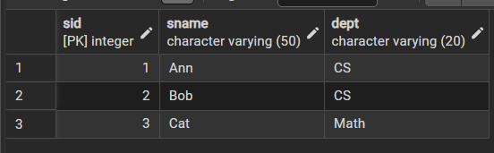
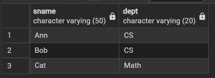
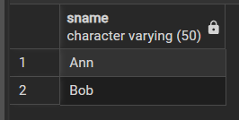
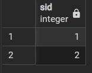
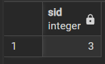
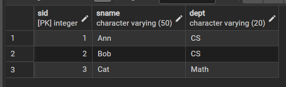
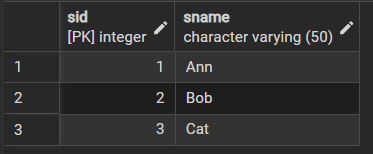
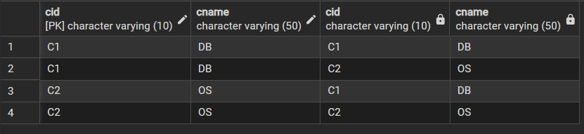
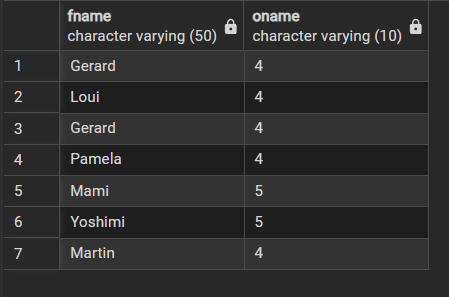
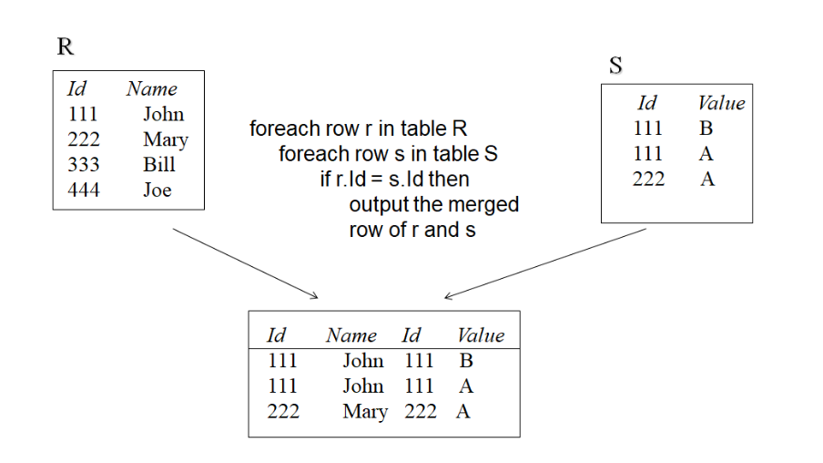

# Basic Operations
## part อ.อภิรักษ์
### Select
```sql
SET search_path TO demo;
select * from student
```
**Result** จะได้ข้อมูลทั้งหมด



```sql
SET search_path TO demo;
select * from student where dept = 'CS'
```
**Result** จะได้ข้อมูลเฉพาะ dept = CS


------

## Project
```sql
SET search_path TO demo;
select sname, dept from student
```
**Result** จะได้เฉพาะ col ที่เลือก



```sql
SET search_path TO demo;
select sname from student where dept = 'CS'
```
**Result** จะได้เฉพาะ col ที่เลือกและที่ dept = 'CS'



----

### Union
```sql
SET search_path TO demo;
select sname from student where dept = 'CS'
union
select sname from student where dept = 'Math'
```
**Result** จะเป็นการ union ตามหลักของ set


----

### Intersection
```sql
SET search_path TO demo;
select sid from student where dept = 'CS' --output {1,2}
intersect
select sid from enroll where cid = 'C1' --output {1,2,3}
```
**Result** จะเป็นการ Intersection ตามหลักของ set



---

## set Difference
```sql
SET search_path TO demo;
select sid from enroll where cid = 'C1'
except
select sid from student where dept = 'CS'
```
**Result** จะเป็นการ Difference ตามหลักของ set



----
### Rename
```sql
SET search_path TO demo;
-- select *  from student
select sid, sname from student as S
```
**Result** เป็นการเปลี่ยนชื่อ table 
- ก่อน Rename



- หลัง Rename จะเห็นว่าเรากำหนดตารางใหม่จากการ Rename ได้ ให้มีชื่อ table กับ col ที่ต้องการ



```sql
SET search_path TO demo;
select sid, sname as name, dept from student 
```
**Result** เป็นการเปลี่ยนชื่อ col


-----

### Cartesian product
```sql
SET search_path TO demo;
select * from course as c1
cross join course as c2
```
**Result**
- ถ้างงให้กลับไปดู slide บท7 หน้า 22
- มันคือเราหา x product ของ table c1, c2




## part อ.กฤษ
### select
คำสั่งต่างๆที่จะใช้ใน ```select```
- distinct -> ตัดค่าที่ซ้ำกันออก และแสดงเฉพาะข้อมูลที่ ไม่ซ้ำกัน (unique)
    ```sql
    SELECT distinct jobtitle FROM classicmodels.employees;
    ```
- คำนวน 
    ```sql
    SELECT checkNumber , paymentDate , amount+10000 
    FROM   classicmodels.payments LIMIT  5 --LIMIT  5 คือเลือกแค่ 5 row
    ```
- string function
    - upper(customername) -> col customer ก็จะตัวพิมพ์ใหญ่
    ```sql
    SELECT customername ,  upper(customername)
    FROM  classicmodels.customers;
    ```
    - lower(customername)

    - reverse(customername)

    - concat(firstName, ' ', lastName) -> ต่อ 2 col เข้าด้วยกันเหมือนการต่อ string 

    - split_part() -> เป็นการแยก string
        - ```split_part(string, delimiter, index)```
        - string → ข้อความต้นฉบับ (เช่น email)
        - delimiter → ตัวคั่น (ในที่นี้คือ '@')
        - index → ตำแหน่งของชิ้นส่วนที่อยากได้ (เริ่มนับจาก 1 ไม่ใช่ 0!)
            - index 1 -> ตำแหน่งหน้าตัวขั้น
            - index 2 -> ตำแหน่งหลังตัวขั้น
        ```sql
        SELECT split_part(email,'@',1) AS emailUsername
        FROM employees LIMIT 5;
        ```

    - rpad -> colที่เลือก, จำนวน string, string ที่จะต่อทางขวา
    - length(customername) -> หา length ของชื่อลูกค้า
    ```sql
    SELECT customername , rpad(customername,30,'-')
    FROM classicmodels.customers;
    ```
    - lpad(customername,30,'-')
- bool
    ```sql
    SELECT creditLimit , creditLimit > 100000
    FROM classicmodels.customers
    LIMIT 10
    ```
-----

### cast
คำสั่ง ```CAST``` ใน SQL ใช้สำหรับ แปลงชนิดข้อมูล (data type) จากชนิดหนึ่งไปเป็นอีกชนิดหนึ่ง
```sql
select CAST(officeCode as integer) from employees
```
**Reslut** -> แปลง officeCode ให้เป็น int

หรือจะเขียนแบบย่อ
```sql
select officeCode::integer from employees
```
------

### where 
คำสั่งต่างๆที่จะใช้ใน ```where``` 
- Rename (Alias) -> เปลี่ยนชื่อ table, col ด้วย ```as```
```sql
SELECT  E.firstName as FNAME, E.officeCode as ONAME
FROM    employees   as E
--cast, bool
WHERE (E.officeCode)::INTEGER > 3 
       and (E.officeCode)::INTEGER <=5
```

**Result** 
- เลือก col, table ที่ต้องการและเปลี่ยนชื่อ 
- ใช้ชื่อที่ตั้งในการ where 
- มีการ cast type และ bool เพื่อให้ได้ผลลัพธ์ตามต้องการ




- bool ```<>``` -> ไม่เท่ากับ
- subsrting comparison -> คือการเอา ค่าที่ได้จาก SUBSTRING มาใช้เปรียบเทียบในเงื่อนไข ```WHERE```
    - ```LIKE``` % **ไม่ sensitive**
        ```sql
        -- ขึ้นต้นด้วย 1
        WHERE officeCode LIKE '1%';

        -- ลงท้ายด้วย A 
        WHERE officeCode LIKE '%A';

        -- มี A อยู่ใน col
        WHERE officeCode LIKE '%A%';
        ```
     - ```LIKE``` __
        ```sql
        SELECT 	FNAME, LNAME
        FROM		EMPLOYEE
        WHERE		BDATE LIKE '195_-__-__';
        ```
        **Result** เลือกคนที่เกิดปี 195X
        
    - ```NOT LIKE```
        ```sql
        SELECT employeeNumber, lastName, firstName 
        FROM employees WHERE lastName NOT ILIKE 'B%';
        ```
        **Result** เลือกคนที่ lastnameไม่ขึ้นต้นด้วย b
        
- IS NULL -> เช็คว่า NULL ใช่ป่าว
- IS NOT NULL -> เช็คว่า NOT NULL ใช่ป่าว
- Arithmetic
    - ```between``` -> ใช้แทน bool ได้
        ```sql
        SELECT * 
        FROM classicmodels.orderdetails
        where priceEach between 150 and 200
       ```
    - คำนวนได้ปกติ

- SQL function
    - COUNT
    - SUM
    - AVG
    ```sql
    SELECT 
    COUNT(*) as total_employees,
    COUNT(reportsTo) as total_reportsTo,
	SUM(reportsTo) as sum_reportsTo,
    AVG(reportsTo) as avg_reportsTo,
	SUM(reportsTo)/COUNT(reportsTo)::numeric
    FROM employees;
    ```
- IN -> ทำงานเหมือน Python
```sql
SELECT contactLastName,   
        salesRepEmployeeNumber
FROM    classicmodels.customers
where   salesRepEmployeeNumber 
			in (1370 ,1501 ,1504 )
```
-----      

### join
คำสั่ง ```JOIN``` ใน SQL ใช้สำหรับ เชื่อมข้อมูลจากหลายตาราง เข้าด้วยกัน โดยอาศัยคอลัมน์ที่มีความสัมพันธ์กัน 

(มักเป็น Primary Key – Foreign Key)

```sql
SELECT *
FROM R JOIN S on R.Id = S. Id
```
**Result** 
- เลือกทุก col ใน table R, S
- ```R JOIN S on R.Id = S. Id``` คือบอกว่าจะ JOIN R, S บน col R.Id = S. Id



### ลำดับการทำงาน
```form > join > where > select```
```sql
SELECT EMPLOYEE_ID, LAST_NAME
  FROM EMPLOYEES
  JOIN DEPARTMENT
    ON DEPARTMENT = DEPT_NAME
 WHERE BUDGET > 275000
```
1. ```form```เลือกทุก col ของ EMPLOYEES
2. ```join``` เข้ากับ table DEPARTMENT ที่ col DEPT_NAME
3. ```where``` เลือกที่ BUDGET > 275000
4. ```selec``` EMPLOYEE_ID, LAST_NAME จาก table EMPLOYEES เป็นผลลัพธ์

**Result** แสดง MPLOYEE_ID, LAST_NAME จาก table EMPLOYEES ที่มี BUDGET > 275000 ของในแต่ละสาขา

