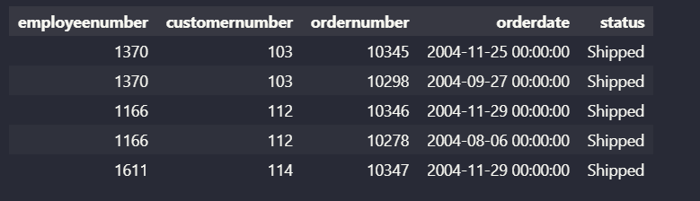

# Join 
เวลา join กันเราจะได้ตารางชั่วคราวที่จะรวมทุกตารางที่เรา join กันไว้เป็น 1 ตารางออกมา

## ตารางสรุป Join
| JOIN             | ความหมาย                                         | แสดงข้อมูลจากตารางซ้าย              | แสดงข้อมูลจากตารางขวา               | เงื่อนไขการจับคู่                       |
| ---------------- | ------------------------------------------------ | ----------------------------------- | ----------------------------------- | --------------------------------------- |
| **JOIN**         | ค่าเริ่มต้นของ JOIN (เหมือน INNER JOIN)          | ✔️ เฉพาะที่ match                   | ✔️ เฉพาะที่ match                   | ต้องตรงตามเงื่อนไข                      |
| **INNER JOIN**   | แสดงเฉพาะแถวที่มีข้อมูลตรงกันทั้งสองตาราง        | ✔️                                  | ✔️                                  | ใช้ ```ON``` หรือ ```USING``` ระบุเงื่อนไข                     |
| **LEFT JOIN**    | แสดงทุกแถวจากตารางซ้าย และเฉพาะที่ตรงจากตารางขวา | ✔️ ทั้งหมด                          | ✔️ เฉพาะที่ match (ไม่ตรงเป็น NULL) | ใช้ ```Left  outer    JOIN  orders o  ON  A.id = B.id```                                  |
| **RIGHT JOIN**   | แสดงทุกแถวจากตารางขวา และเฉพาะที่ตรงจากตารางซ้าย | ✔️ เฉพาะที่ match (ไม่ตรงเป็น NULL) | ✔️ ทั้งหมด                          | ใช้ ```RIGHT  outer    JOIN  orders o  ON  A.id = B.id```                                  |
| **SELF JOIN**    | Join ตารางเดียวกันกับตัวเอง                      | ✔️                                  | ✔️                                  | ใช้ ```alias ```แยกตาราง                      |
| **NATURAL JOIN** | Join โดยอัตโนมัติจากชื่อคอลัมน์ที่เหมือนกัน      | ✔️                                  | ✔️                                  | ใช้ ```natural join``` |

หมายเหตุสำคัญ

- ถ้าเขียน ```JOIN```  เฉยๆ จะถูกมองเป็น ```INNER JOIN``` โดย default
- ```LEFT JOIN``` / ```RIGHT JOIN``` ใช้เมื่อต้องการเก็บข้อมูลที่ ไม่มีคู่
- ```SELF JOIN``` เหมาะกับข้อมูลเชิงลำดับชั้น เช่น พนักงาน–หัวหน้า
- ```NATURAL JOIN``` ใช้ง่ายแต่ เสี่ยง error หากมีหลายคอลัมน์ชื่อเหมือนกันโดยไม่ตั้งใจ


## INNER 
ใช้ inner join ต่อเมื่อ
- ต้องการเชื่อม 2 ตารางเข้าด้วยกันโดยที่สนใจว่า ```ต้องมี col ที่ชื่อตรงกัน``` ของทั้ง 2 ตาราง

### ```on``` vs ```using```
- ทั้ง 2 ใช้กับ inner join เหมือนกันแต่ต่างกันที่ 
     1. แต่ ```on``` คือรูป**เต็ม** ของการเขียน inner join ส่วน ```using``` คือรูป**ย่อ** ของการเขียน inner join
     2. ```on``` สามารถเชื่อม 2 ตารางได้แม้ทั้ง 2 ตารางจะไม่มี col ที่ชื่อเหมือนกัน

### ตัวอย่างกรณีมี col เดียวกันทั้ง 2 ตาราง

- ใช้ ```on```
```sql
SELECT 
  customerName,
  orderNumber,
  orderDate
FROM orders --ตารางที่เลือก
JOIN customers --ตารางที่จะไป join
  ON customers.customerNumber = orders.customerNumber --บอกว่าจะใช้ col ไหน join กัน
WHERE orderDate BETWEEN '2003-05-01' AND '2004-05-01' --ปี-เดือน-วัน
LIMIT 5;
```
------

- ใช้ ```using```
```sql
select
    customername,
    ordernumber,
    orderdate
from
    orders --ตารางที่เลือก
    JOIN customers USING (customernumber) --ตารางที่จะไป join และบอกว่าจะใช้ col ไหน join กัน
WHERE
    orderdate BETWEEN '2003-05-01' AND '2004-05-01'
LIMIT 5;
```

**Result**
- ได้ output เหมือนกันทั้ง ```on``` และ ```using```


### ตัวอย่างกรณีไม่มี col เดียวกันทั้ง 2 ตาราง
```EXTRACT``` คืออะไร
- เป็นการดึงค่าออกมาจาก col มาเก็บที่ตัวแปรในตัวอย่างนี้ต้องการดึง year มาใช้เปรียบเทียบ

```EXTRACT(field FROM date_column)```

field ที่ใช้บ่อย เช่น
 - year → ปี
- month → เดือน
- day → วัน
    - ทำไมไม่ใช้ ```LIKE``` 
        - เพราะ ```LIKE``` เอาไว้ใช้กับ string แต่ ```orderdate``` เป็นวันที่

- ใช้ ```on```
```sql
SELECT 
    employeenumber, 
    orders.customernumber, 
    ordernumber, 
    orderdate, 
    status
FROM employees
    JOIN customers ON customers.salesrepemployeenumber = employees.employeenumber
    JOIN orders ON orders.customernumber = customers.customernumber
WHERE 
    extract(year from orderdate) = 2004 AND --อธิบายคำสั่งนี้ไว้ด้านบน
    status IN ('Shipped', 'Resolved')
```

**Result**
- ได้ผลลัพธ์ตามต้องการแม้ทั้ง 2 ตารางจะไม่มี col ที่ชื่อเหมือนกัน




- ใช้ ```using```
```sql
SELECT 
    employeenumber, 
    customernumber, 
    ordernumber, 
    orderdate, 
    status
FROM employees
    JOIN customers USING (salesrepemployeenumber) --คู่นี้ทำให้ error
    JOIN orders USING (customernumber) --คู่นี้ใช้ USING ได้ปกติ
WHERE 
    extract(year from orderdate) = 2004 AND
    status IN ('Shipped', 'Resolved')
```
**Result**
- error เพราะไม่มี col ที่ชื่อเหมือนกันทั้ง 2 ตาราง

```
RuntimeError: (psycopg2.errors.UndefinedColumn) column "salesrepemployeenumber" specified in USING clause does not exist in left table
```

-----

## NATURAL 
### INNER JOIN vs NATURAL JOIN
```INNER JOIN``` , ```NATURAL JOIN``` คือการที่เชื่อม col ที่เหมือนกันของ 2 ตาราง 

แต่ต่างกันที่ **เมื่อไม่มี col ที่ตรงกัน**
- INNER JOIN 
    - ไม่ทำการ join 
    - แจ้ง error

- NATURAL JOIN
    - ทำ cartesian product ให้ทั้งๆที่ไม่ต้องการ


## count()
ฟังก์ชัน ```COUNT()``` เป็น aggregate function ที่ใช้นับจำนวนแถว (rows) ในตาราง ซึ่งเป็นหนึ่งในฟังก์ชันที่ใช้บ่อยที่สุดในการวิเคราะห์ข้อมูล

**ตัวอย่าง**

```sql
select count(*) from classicmodels.orders;
```

นับจำนวนแถวทั้งหมดในตาราง รวมถึงแถวที่มีค่า NULL