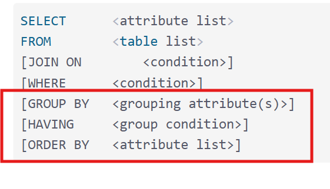
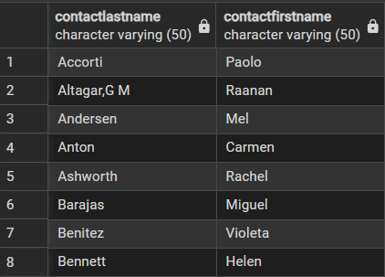
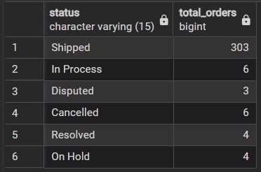

# Other clause


## ORDER BY
- เป็นคำสั่งที่ใช้ในการเรียง (Sorting)
- ASC (ASCENDING) = เรียงจากน้อย -> มาก
- DESC (DESCENDING) = เรียงจากมาก -> น้อย

**ตัวอย่าง**
```sql
SELECT contactLastname, contactFirstname 
FROM classicmodels.customers 
--ORDER BY RANDOM() --กรณีต้องการสุ่มค่า
ORDER BY contactLastname ASC; --เรียงจากน้อย -> มาก
```
**result**
- จะเห็นว่าเรียงลำดับตามนามสกุล



## GROUP BY
- เป็นคำสั่งที่ใช้ในการจัดกลุ่ม (Grouping) โดยแถวข้อมูลที่มีค่าเหมือนกันใน col ที่กำหนด
- จะใช้คู่กับ ฟังก์ชันสรุปผล (Aggregate Functions) เช่น
    - COUNT() → นับจำนวน
    - SUM() → รวมค่า
    - AVG() → ค่าเฉลี่ย
    - MIN(), MAX()
- col ที่อยู่ใน ```SELECT``` ต้องอยู่ใน ```GROUP BY```
    - จากตัวอย่าง `status` อยู่ใน SELECT ดังนั้น `status` ต้องอยู่ใน ```GROUP BY``` ด้วยไม่งั้นจะ error

**ตัวอย่าง**
```sql
SELECT 
    status,
    COUNT(*) as total_orders
FROM classicmodels.orders
GROUP BY status;
```

**result**
- จะเห็นว่ามีการจับกลุ่ม(GROUP BY) และนำจำนวน(COUNT)



## HAVING
เป็นคำสั่งที่ใช้ กรองข้อมูลหลังจาก GROUP BY คล้ายกับ WHERE แต่ใช้กับข้อมูลที่จัดกลุ่มแล้ว 

ใช้ HAVING เมื่อ:
- ต้องการกรองผลลัพธ์ของ GROUP BY
- เกี่ยวข้องกับ aggregate functions
    - aggregate -> SUM(), MIN(), MAX(), AVG()

### ```WHERE``` vs ```HAVING```

คำสั่ง |ใช้เมื่อไรทำงานก่อน/หลัง| GROUP BY|
-----|-------------------|----------|
```WHERE```| กรองข้อมูลแต่ละแถว (ก่อนจัดกลุ่ม)| ก่อน ```GROUP BY```
```HAVING```| กรองข้อมูลที่จัดกลุ่มแล้ว |หลัง ```GROUP BY```

**ตัวอย่าง**
```sql
-- หาลูกค้าที่สั่งซื้อมากกว่า 5 ครั้ง
SELECT customerNumber, COUNT(*) as total_orders
FROM classicmodels.orders
GROUP BY customerNumber
HAVING COUNT(*) > 5  -- ✅ ใช้ HAVING กรองหลัง GROUP BY
ORDER BY total_orders DESC; --DESC คือเรียงจากน้อย -> มาก
```

**Result**

