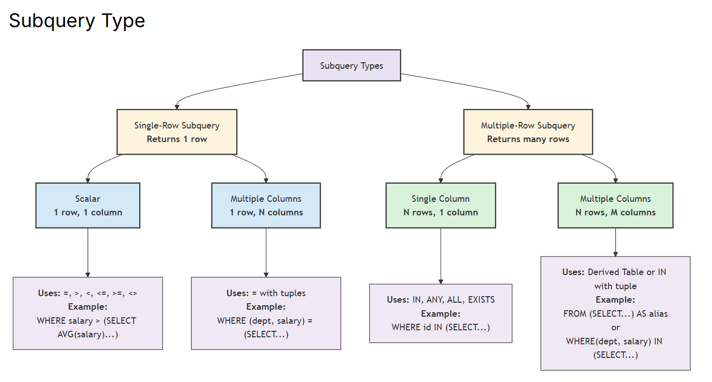
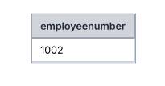
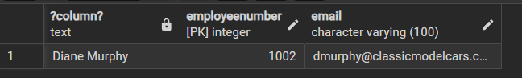
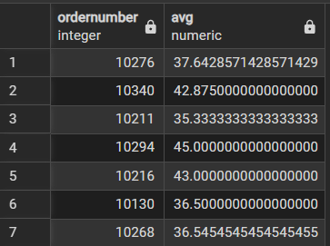
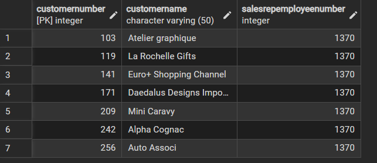
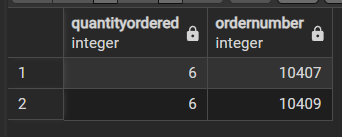
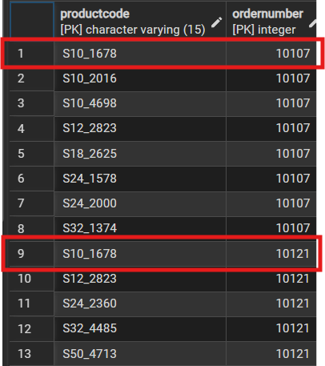
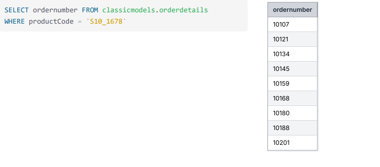

# Advance Qeury
- Subqeury -> การ Qeury ซ้อนอยู่ใน Qeury เพื่อให้ได้ผลลัพธ์ที่ต้องการ
- Correlatate Subqeury -> ความสัมพัธ์ของ Subqeury

## Subqeury 


### Single Row Subqueries 
- ถ้าเขียนอยู่ใน ```WHERE``` จะเป็น Single เพราะจะได้ ค่าเดียวออกมา
- บางที่ก็อยู่ใน ```HAVING``` เพราะมีการใช้ ```GROUP BY```
- สังเกตว่า
    - 1 row, 1 column -> ```WHERE salary``` where มาแค่ตัวเเดียว
    - Multiple Columns -> ```WHERE (dept, salary)``` where มา > 1


**ตัวอย่าง อยู่ใน ```WHERE```**
```sql
select
firstname || ' ' || lastname,
employeenumber,
email
from
    classicmodels.employees
where
    employeenumber = (
        select
            employeenumber
        from
            classicmodels.employees
        where
            firstname || ' ' || lastname ilike 'diane murphy'
    )
```
**result**
- จะได้ employeenumber ของ ```diane murphy``` มา





**ตัวอย่าง อยู่ใน ```HAVING```**
```sql
SELECT  o.orderNumber, AVG( o.quantityOrdered )
FROM orderdetails  o
GROUP BY o.orderNumber
HAVING AVG(o.quantityOrdered ) > 
    (
               SELECT AVG(d.quantityOrdered) 
               FROM orderdetails as d 
    );
```
**result**




**ตัวอย่าง 1 row, Multiple Columns**
```sql
select a.customernumber, a.customername, a.salesrepemployeenumber 
    from 
      (select e.employeenumber,o.officecode,c.customername,c.customernumber,
   c.salesrepemployeenumber 
   from employees e 
   left join offices o on e.officecode = o.officecode 
   left join customers c on c.salesrepemployeenumber = e.employeenumber ) as a

where (a.salesrepemployeenumber,a.officecode) = 
 (select e.employeenumber,o.officecode 
   from employees e left join offices o on e.officecode = o.officecode 
   where e.employeenumber = 1370);
```
**result**
- ถ้า qeury แค่
```sql
select e.employeenumber,o.officecode 
   from employees e left join offices o on e.officecode = o.officecode 
   where e.employeenumber = 1370
```
- จะได้ (เห็นภาพ 1 row, N col)


- output สุดท้าย




-------------------------

### Multiple-Row Subquery 
- ถ้าเขียนอยู่ใน ```FROM``` มันจะเป็น Multiple อยู่แล้ว เพราะจะได้ตารางออกมาเลย 1 ตาราง
- บางกรณีก็เขียนใน ```IN```,  ```NOT IN```,  ```ANY```,  ```ALL```, ```DISTINCT```
    - ```DISTINCT``` = เอาเฉพาะค่าที่ ไม่ซ้ำ
    -  ```ANY``` = ตัวใดตัวนึง true ถึงจะเป็น true
    - ```ALL``` = ต้องเป็น true ทั้งหมด ถึงจะเป็น true
- สังเกตว่า
    - N rows, 1 column
    - N rows, M columns


**ตัวอย่าง อยู่ใน ```FROM```**
```sql
select quantityordered,ordernumber from (select quantityordered,ordernumber from orderdetails where quantityordered < 10)
```

**result**
- จะเห็นว่า ``` quantityordered < 10``` มี 2 row ออกมา




**ตัวอย่าง อยู่ใน ```IN```**
- ต้องการหา order ที่ซื้อสินค้า ```S10_1678``` (รหัส) 
- จากนั้นแสดงรายการสินค้าทั้งหทดในใบ order นั้นๆ
```sql
SELECT productCode, ordernumber
FROM classicmodels.orderdetails
WHERE ordernumber IN 
(SELECT ordernumber FROM classicmodels.orderdetails 
WHERE productCode = 'S10_1678' )
```

**result**
- กรอบสีแดงคือ order ที่ซื้อ ```S10_1678```
- ที่ไม่ใส่กรอบคือ รายการสินค้าที่ซื้อใน order นั้นๆ



- ถ้ารันแค่
```sql
(SELECT ordernumber FROM classicmodels.orderdetails 
```

- จะเห็นภาพ order ที่ซื้อ ```S10_1678```


----

### Multiple and Single Row Subqueries
- ตัวอย่างการเขียนใน ```SELECT```
```sql
select ordernumber,quantityordered
from orderdetails, 
(SELECT AVG(quantityordered) as avg 
  FROM orderdetails 
  WHERE ordernumber = 10100) as a
where quantityordered> a.avg
```