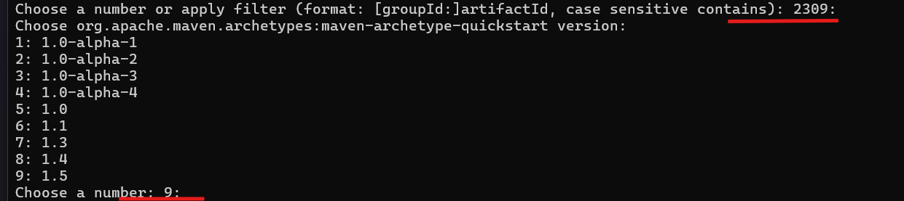
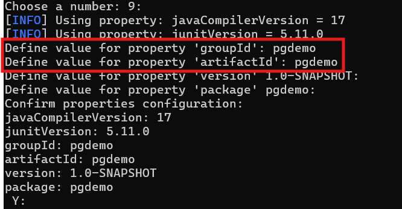
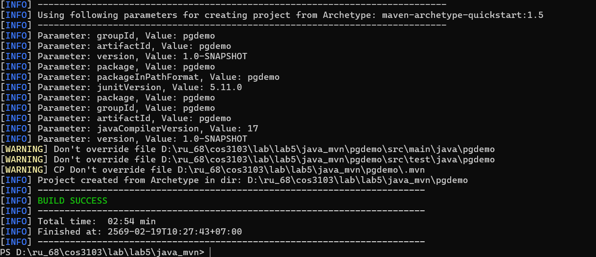
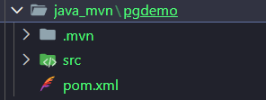
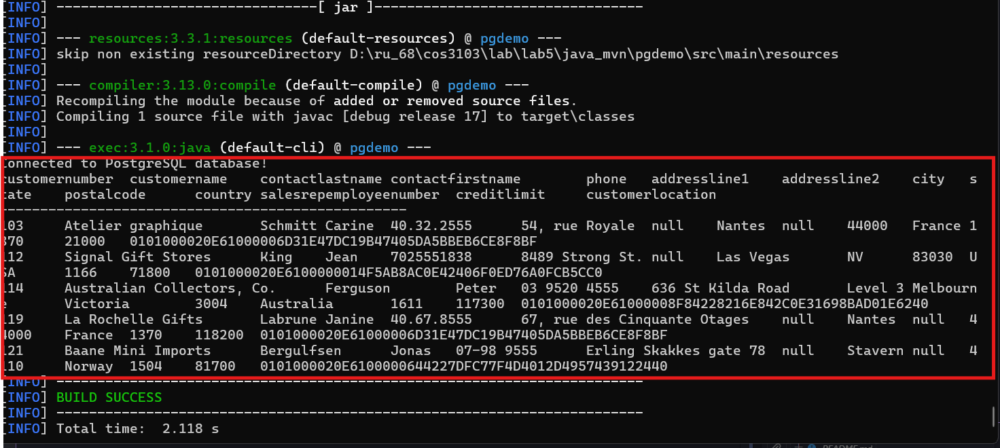
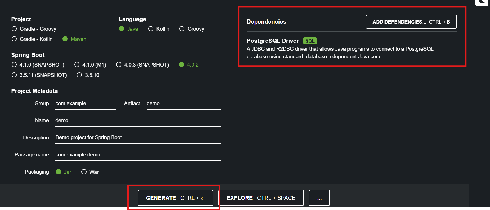
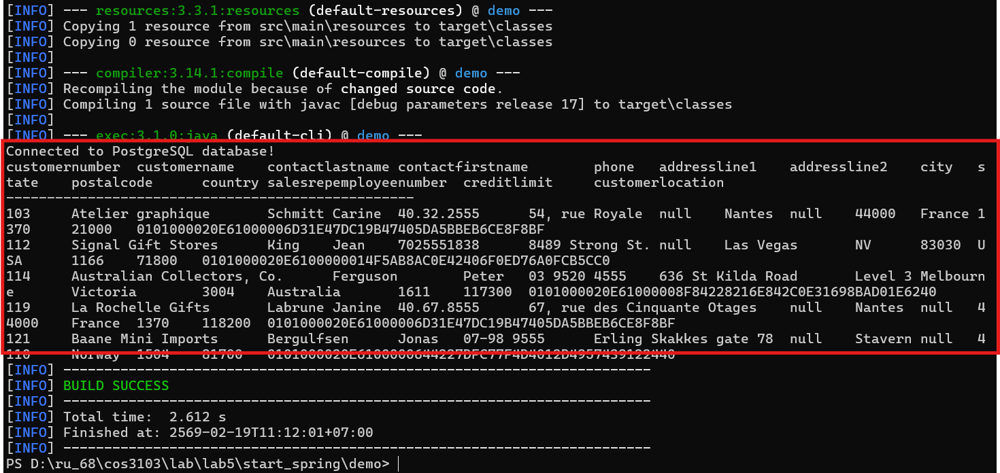

# Application Demo
เลือกใช้ตามที่ ถนัดได้เลย

## ใน lab นี้เราทำอะไร
ได้ลองใช้ `tools` 3 ตัว ในการเริ่มทำ project 

### .NET 10.0 SDK 
- ทำไม่ได้อาจเพราะเป็นที่ Window 11

-------

### Java & Maven
**วิธีทำ**
1. ให้สร้างโฟลเดอร์ไว้เพื่อเก็บโปรเจคในที่ ที่ต้องการ ใน lab นี้ชื่อ `java_mvn`
2. เปิด `Power shell` ไปที่ path ที่เก็บโฟลเดอร์ไว้
3. ใช้คำสั่ง `mvn archetype:generate` 

    ตัวอย่าง
    `PS D:\ru_68\cos3103\lab\lab5\java_mvn> mvn archetype:generate`

    ให้กด `enter`
    

    

    จากนั้นใส่ `pgdemo` 2 ที่ตามกรอบสีแดง ที่เหลือให้ `enter`

    

    ถ้าทุกอย่างถูกต้องจะได้

    

4. ไปดูที่ vscode จะพบว่ามีโฟลเดอร์ `pgdemo` โผล่ขึ้นมา

    

5. แก้ไข `pom.xml` เพิ่ม code ตามนี้

    - dependency
    ```xml
        <dependency>
            <groupId>org.postgresql</groupId>
            <artifactId>postgresql</artifactId>
            <version>42.7.1</version>
        </dependency>
    ```
    - plugin
    ```xml
    <plugin>
        <groupId>org.codehaus.mojo</groupId>
        <artifactId>exec-maven-plugin</artifactId>
        <version>3.1.0</version>
        <configuration>
        <mainClass>pgdemo.App</mainClass>
        </configuration>
    </plugin>
    ```
6. แก้ไข `App.java` ตามนี้
    ```java
    package pgdemo;
    import java.sql.*;
    public class App {
        public static void main(String[] args) {
            // PostgreSQL connection parameters
            String url = "jdbc:postgresql://localhost:5432/postgres";
            String username = "postgres";
            String password = "12345678";
            try (Connection conn = DriverManager.getConnection(url, username, password)) {
                System.out.println("Connected to PostgreSQL database!");
                // Create statement
                Statement stmt = conn.createStatement();
                // Execute query
                String sql = "SELECT * FROM classicmodels.customers LIMIT 5";
                ResultSet rs = stmt.executeQuery(sql);
                // Get metadata
                ResultSetMetaData metadata = rs.getMetaData();
                int columnCount = metadata.getColumnCount();
                // Print column names
                for (int i = 1; i <= columnCount; i++) {
                    System.out.print(metadata.getColumnName(i) + "\t");
                }
                System.out.println("\n" + "-".repeat(50));
                // Process results
                while (rs.next()) {
                    for (int i = 1; i <= columnCount; i++) {
                        System.out.print(rs.getString(i) + "\t");
                    }
                    System.out.println();
                }
                rs.close();
                stmt.close();
                
            } catch (SQLException e) {
                System.err.println("Database error: " + e.getMessage());
                e.printStackTrace();
            }
        }
    }
    ```
7. cd เข้าโฟลเดอร์โปรเจคก่อน `PS D:\ru_68\cos3103\lab\lab5\java_mvn\pgdemo>`
8. ลอง run ด้วยคำสั่ง `mvn compile exec:java`

    ถ้าถูกต้องจะได้ตารางที่เราเขียน query ไว้ใน `App.java`

    


วิธีทำแบบละเอียดให้ดูจาก: [Slide หน้า127](https://drive.google.com/drive/u/0/folders/1-ALfovQlpNBpBNqAo91g5dimx0NMDX_s) 

-------

### [Other Solution]( https://start.spring.io/)
**วิธีทำ**
1. ให้ add `dependency` ตามนี้ แล้วกด`enter` วิธีทำเหมือน java & maven แต่จะมี GUI มาช่วย



2. จะได้ไฟล์ zip มา ถ้าแตกดูก็จะได้โฟลเดอร์ project มาเลย
3. แก้ `pom.xml`  
    - dependency ให้ลบที่เป็น spring boot ออกให้หมดเพราะไม่ได้ใช้

    - plugin แก้ชื่อ mainClass ให้ตรงกับชื่อไฟล์ `.java` ใน `main`
    ```xml
    <plugin>
        <groupId>org.codehaus.mojo</groupId>
        <artifactId>exec-maven-plugin</artifactId>
        <version>3.1.0</version>
        <configuration>
            <mainClass>com.example.demo.DemoApplication</mainClass>
        </configuration>
    </plugin>
    ```
4. แก้ `DemoApplication.java` 

    ```java
    package com.example.demo;

    import java.sql.*;
    public class DemoApplication {
        public static void main(String[] args) {
            // PostgreSQL connection parameters
            String url = "jdbc:postgresql://localhost:5432/postgres";
            String username = "postgres";
            String password = "12345678";
            try (Connection conn = DriverManager.getConnection(url, username, password)) {
                System.out.println("Connected to PostgreSQL database!");
                // Create statement
                Statement stmt = conn.createStatement();
                // Execute query
                String sql = "SELECT * FROM classicmodels.customers LIMIT 5";
                ResultSet rs = stmt.executeQuery(sql);
                // Get metadata
                ResultSetMetaData metadata = rs.getMetaData();
                int columnCount = metadata.getColumnCount();
                // Print column names
                for (int i = 1; i <= columnCount; i++) {
                    System.out.print(metadata.getColumnName(i) + "\t");
                }
                System.out.println("\n" + "-".repeat(50));
                // Process results
                while (rs.next()) {
                    for (int i = 1; i <= columnCount; i++) {
                        System.out.print(rs.getString(i) + "\t");
                    }
                    System.out.println();
                }
                rs.close();
                stmt.close();
                
            } catch (SQLException e) {
                System.err.println("Database error: " + e.getMessage());
                e.printStackTrace();
            }
        }
    }
    ```
7. cd เข้าโฟลเดอร์โปรเจคก่อน `PS D:\ru_68\cos3103\lab\lab5\start_spring\demo>`
8. ลอง run ด้วยคำสั่ง `.\mvnw clean compile exec:java`

    ถ้าถูกต้องจะได้ตารางที่เราเขียน query ไว้ใน `DemoApplication.java` 

    

วิธีทำแบบละเอียดให้ดูจาก: [Slide หน้า136](https://drive.google.com/drive/u/0/folders/1-ALfovQlpNBpBNqAo91g5dimx0NMDX_s)