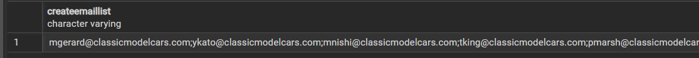
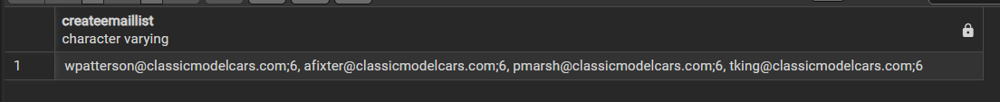
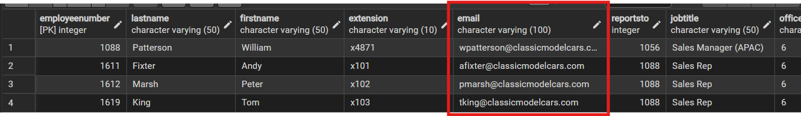

# Cursor
Cursor คือตัวช่วยที่ทำให้เรา `ไล่อ่านข้อมูลทีละแถว (row-by-row)` จากผลลัพธ์ของคำสั่ง `SELECT` ปกติ SQL จะดึงข้อมูลออกมาทีเดียวทั้งหมดแต่ Cursor จะทำให้เรา `เปิดผลลัพธ์ไว้ก่อน` แล้วค่อย ๆ ดึงออกมาทีละแถว

## ตัวอย่าง code1: cursor
- ต้องการ list email ของพนักงาน
```sql
DROP FUNCTION IF EXISTS createemaillist;
 
CREATE OR REPLACE FUNCTION createemaillist( )
RETURNS varchar(4000)
LANGUAGE plpgsql
AS $$
DECLARE
    emaillist varchar(4000) := ''; --เก็บผลลัพธ์จาก cursor
    emailaddress varchar(100); --เก็บผลลัพธ์จาก col email

    curEmail CURSOR FOR 
               SELECT email FROM employees;
BEGIN
    OPEN curEmail;

    LOOP
        FETCH curEmail INTO emailaddress;
        EXIT WHEN NOT FOUND;
        emaillist := emailaddress || ';' || emaillist;
    END LOOP;

    CLOSE curEmail;
	RETURN emaillist;
END;
$$;

--ดู output
select createemaillist( )
```

**output**




## ตัวอย่าง code2: cursor + if
- ต้องการ list email ของพนักงานที่มี officecode = 6
```sql
DROP FUNCTION IF EXISTS createemaillist;
 
CREATE OR REPLACE FUNCTION createemaillist( )
RETURNS varchar(4000)
LANGUAGE plpgsql
AS $$
DECLARE
    emaillist varchar(4000) := '';
    emailaddress varchar(100);
    officelist varchar(100);

    curEmail CURSOR FOR 
               SELECT email, officecode FROM employees;
BEGIN
    OPEN curEmail;

    LOOP
        FETCH curEmail INTO emailaddress, officelist ;
        EXIT WHEN NOT FOUND;
        IF officelist = '6' then
                IF emaillist = '' THEN
                        emaillist := emailaddress || ';' || officelist;
                    ELSE
                        -- ถ้ามีคนก่อนหน้าแล้ว ให้เอาของเดิมมา ต่อด้วยลูกน้ำ แล้วค่อยต่อด้วยคนใหม่
                        emaillist := emaillist || ', ' || emailaddress || ';' || officelist;
                    END IF;
        END IF;
    END LOOP;

    CLOSE curEmail;
    RETURN emaillist;
END;
$$;

--ดู output
select createemaillist( )
```

**output**

จะเห็นว่าได้ email ของพนักงานที่มี officecode = 6






