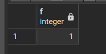
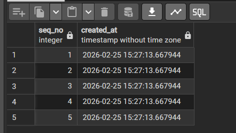

# Stored Procedures
Stored Procedure คือโปรแกรม SQL ที่เก็บไว้ในฐานข้อมูล
- เขียน logic + SQL ไว้ใน database
- เรียกใช้ได้เหมือน function
- เหมือน **ฟังก์ชัน** ในโปรแกรม แต่เก็บอยู่ใน database

## สิ่งที่ทำในหัวข้อนี้:
- เริ่มจาก **Anonymous Block** (`DO $$ ... $$`) เพื่อรัน logic ทันทีโดยไม่ต้องเก็บชื่อ
- เขียน Procedure พื้นฐานด้วย `CREATE OR REPLACE PROCEDURE ...`
- เรียกใช้งานด้วย `CALL`
- ใช้โครงสร้างควบคุม เช่น `IF / ELSIF / ELSE`, `CASE`, `WHILE`, `FOR`
- ใช้ `SELECT ... INTO` ดึงค่าหลายคอลัมน์มาใส่ตัวแปร
- สร้าง Function ที่คืนค่าเดี่ยว (`RETURNS integer`)
- สร้าง Function ที่คืนหลายแถวด้วย `RETURNS TABLE`

## 1) Anonymous Block
คือชุดคำสั่งโปรแกรมที่เขียนแล้วรันทันที โดยไม่ต้องตั้งชื่อ และไม่ถูกเก็บไว้ในฐานข้อมูล

**คำอธิบายเพิ่มเติม**
- เหมาะกับงานทดลอง logic, เช็กเงื่อนไข, หรือรันงานครั้งเดียว (one-time script)
- ข้อดีคือเขียนเร็ว ไม่ต้อง `CREATE` วัตถุถาวรในฐานข้อมูล
- ข้อจำกัดคือเรียกซ้ำด้วยชื่อเดิมไม่ได้ เพราะไม่มีชื่อให้ `CALL`
- โครงสร้างหลักคือ `DECLARE -> BEGIN -> EXCEPTION -> END`
    - `DECLARE` ใช้ประกาศตัวแปร
    - `BEGIN ... END` คือส่วนที่ทำงานจริง
    - `EXCEPTION` ใช้ดัก error เพื่อไม่ให้ script หยุดแบบไม่ควบคุม

### ตัวอย่าง Syntax
```sql
DECLARE
   -- ประกาศตัวแปร
BEGIN
   -- คำสั่งที่ต้องการทำ
EXCEPTION
   -- จัดการ error (ถ้ามี)
END;
```

### ตัวอย่าง code CASE & FOR
```sql
DO $$
DECLARE
    v_num integer;
    v_result text;
BEGIN
    FOR v_num IN 1..5 LOOP
        
        CASE 
            WHEN v_num % 2 = 0 THEN
                v_result := 'Even';
            WHEN v_num % 2 = 1 THEN
                v_result := 'Odd';
            ELSE
                v_result := 'Unknown';
        END CASE;

        RAISE NOTICE 'Number: %, Type: %', v_num, v_result;
    END LOOP;
END;
$$;
```

**output**
```
NOTICE:  Number: 1, Type: Odd
NOTICE:  Number: 2, Type: Even
NOTICE:  Number: 3, Type: Odd
NOTICE:  Number: 4, Type: Even
NOTICE:  Number: 5, Type: Odd
DO
```

**อธิบายตัวอย่าง CASE & FOR**
- `FOR v_num IN 1..5 LOOP` คือวนค่าตั้งแต่ 1 ถึง 5
- `v_num % 2` ใช้เช็กเลขคู่/คี่
- `CASE` ช่วยแยกเงื่อนไขให้อ่านง่ายกว่าการซ้อน `IF` หลายชั้น
- `RAISE NOTICE` ใช้พิมพ์ข้อความระหว่างรัน เหมาะกับการ debug

## 2) Procedures
Procedure คือชุดคำสั่งที่มีชื่อ เก็บไว้ในฐานข้อมูล และเรียกใช้ด้วย `CALL`
- เหมาะกับงานที่ต้องการให้ฝั่ง database ทำขั้นตอนซ้ำ ๆ
- สามารถมี `IN`, `OUT`, `INOUT` parameters ได้
- โดยทั่วไป Procedure ไม่ได้คืนค่าแบบตรง ๆ เหมือน Function แต่ส่งผลผ่าน `OUT` หรือทำงานกับข้อมูลโดยตรง

### Basic
```sql
CREATE OR REPLACE PROCEDURE test_proc()
LANGUAGE plpgsql
AS $$
BEGIN
 RAISE NOTICE 'Hello';
END;
$$;
```
```sql
CALL test_proc();
```

- เมื่อ call ดูจะได้ output

```
NOTICE:  Hello
CALL
```

**อธิบายตัวอย่าง Basic**
- `CREATE OR REPLACE` ช่วยให้แก้โค้ดแล้วรันทับของเดิมได้
- `LANGUAGE plpgsql` ระบุว่าใช้ภาษา procedural ของ PostgreSQL
- `test_proc()` ไม่มีพารามิเตอร์ และแค่แสดงข้อความด้วย `RAISE NOTICE`

-----

### if-else
```sql
-- ไม่เขียนก็ได้ถ้ามั่นใจว่าไม่มีที่สร้างไว้ก่อน
DROP PROCEDURE IF EXISTS demo_proc();

CREATE OR REPLACE PROCEDURE demo_proc()
LANGUAGE plpgsql
AS $$
DECLARE
    v_name text;
    v_count integer := 0;
    v_created_at timestamp := now();
BEGIN
    v_name := 'John';

    WHILE v_count < 5 LOOP
        
        v_count := v_count + 1;

        -- IF logic
        IF v_count = 3 THEN
            RAISE NOTICE 'Reached three!';
        ELSIF v_count > 3 THEN
            RAISE NOTICE 'More than three: %', v_count;
        ELSE
            RAISE NOTICE 'Count is: %', v_count;
        END IF;

    END LOOP;

    RAISE NOTICE 'Finished. Name: %, Created At: %', 
                 v_name, v_created_at;
END;
$$;

call demo_proc();
```

- output
```
NOTICE:  procedure demo_proc() does not exist, skipping
NOTICE:  Count is: 1
NOTICE:  Count is: 2
NOTICE:  Reached three!
NOTICE:  More than three: 4
NOTICE:  More than three: 5
NOTICE:  Finished. Name: John, Created At: 2026-02-25 15:20:55.055596
CALL
```

**อธิบายตัวอย่าง if-else**
- `DROP PROCEDURE IF EXISTS` ช่วยกัน error ตอนสร้างซ้ำ
- `v_count integer := 0` คือกำหนดค่าเริ่มต้น
- `WHILE` ทำงานจนกว่าเงื่อนไข `v_count < 5` จะเป็นเท็จ
- ภายในลูปใช้ `IF / ELSIF / ELSE` เพื่อกำหนดข้อความตามช่วงของค่า
- `v_created_at := now()` จะเก็บเวลาตอนเริ่มรัน procedure

-----

### Select into multiple variable
```sql
DROP PROCEDURE IF EXISTS countorderstatus(OUT vtotal integer,
      OUT vShipped integer,OUT vDisputed integer);

CREATE OR REPLACE PROCEDURE countorderstatus(
    OUT vtotal integer,
    OUT vShipped integer,
    OUT vDisputed integer
)
LANGUAGE plpgsql
AS $$
BEGIN
    SELECT 
        COUNT(*),
        SUM(CASE WHEN status = 'Shipped'  THEN 1 ELSE 0 END),
        SUM(CASE WHEN status = 'Disputed' THEN 1 ELSE 0 END)
    INTO vtotal, vShipped, vDisputed
    FROM orders;

    RAISE NOTICE 'vtotal: %, vShipped: %, vDisputed: %',
                 vtotal, vShipped, vDisputed;
END;
$$;

CALL countorderstatus(vtotal=>NULL,vShipped=>NULL,vDisputed=>NULL);
```

**อธิบายตัวอย่าง SELECT INTO หลายตัวแปร**
- `OUT` parameter คือช่องผลลัพธ์ที่ procedure ส่งกลับ
- `SELECT ... INTO vtotal, vShipped, vDisputed` คือการ map ค่าจาก query ไปยังตัวแปรหลายตัวพร้อมกัน
- `SUM(CASE WHEN ... THEN 1 ELSE 0 END)` เป็นเทคนิคการนับตามเงื่อนไข
- ตอน `CALL` ที่ส่ง `NULL` เป็นเพียงรูปแบบการระบุชื่อ argument ให้ตรงกับ `OUT`

## 3) Function in PostGreSQL
- มีการ Return table ออกมา

Function คือโปรแกรมที่ "ต้องมีค่า return" และสามารถเรียกใน `SELECT` ได้
- เหมาะกับงานคำนวณ/แปลงค่า หรือสร้างผลลัพธ์ที่ต้องนำไปใช้ต่อใน query
- ต่างจาก Procedure ตรงที่ Function คืนค่าโดยตรงผ่าน `RETURN` หรือ `RETURN QUERY`
- ถ้าคืนค่าเดียวใช้ `RETURNS <type>` และถ้าคืนหลายแถวใช้ `RETURNS TABLE (...)`

### ตัวอย่าง1: Return 1
```sql
DROP FUNCTION IF EXISTS f();

CREATE FUNCTION f()
RETURNS integer
LANGUAGE plpgsql
AS $$
DECLARE
    x integer;
BEGIN
    SELECT 1 INTO x; --ไม่รับ parameter กำหนดให้ x เป็น 1 เสมอ
    RETURN x;
END;
$$;

SELECT f();
```
- output



**อธิบายตัวอย่าง Return 1**
- ฟังก์ชัน `f()` ไม่มีพารามิเตอร์ และกำหนดชนิดผลลัพธ์เป็น `integer`
- ใช้ `SELECT 1 INTO x` เพื่อใส่ค่าในตัวแปร แล้ว `RETURN x`
- เวลาเรียกใช้สามารถเขียนในคำสั่ง SQL ปกติ เช่น `SELECT f()`

-----

### ตัวอย่าง2: Return Table Template
- จะเห็นว่า function มีการรับ parameter ด้วย

```sql
DROP FUNCTION IF EXISTS seqNo(p_limit integer);

CREATE OR REPLACE FUNCTION seqNo(p_limit integer)
RETURNS TABLE (
    seq_no integer,
    created_at timestamp
)
LANGUAGE plpgsql
AS $$
DECLARE
    v_counter integer := 1;
BEGIN

    WHILE v_counter <= p_limit LOOP
        
        RETURN QUERY
        SELECT 
            v_counter,
            now()::timestamp;
            -- now() -> timestampz
        v_counter := v_counter + 1;

    END LOOP;

END;
$$;

SELECT * FROM seqNo(5)
```
- output



**อธิบายตัวอย่าง Return Table**
- รับพารามิเตอร์ `p_limit` เพื่อกำหนดจำนวนแถวที่จะสร้าง
- `RETURNS TABLE (seq_no, created_at)` ระบุ schema ของผลลัพธ์ล่วงหน้า
- `RETURN QUERY` ใช้ส่งคืนผลลัพธ์เป็นชุดแถว
- ในตัวอย่างนี้ลูปจะสร้างแถวเพิ่มทีละ 1 จนถึง `p_limit`

**สรุปสั้น ๆ: Procedure vs Function**
- ใช้ Procedure เมื่อเน้น “ทำงาน” (process) และเรียกด้วย `CALL`
- ใช้ Function เมื่อเน้น “คืนค่า” (result) และเรียกใน `SELECT`