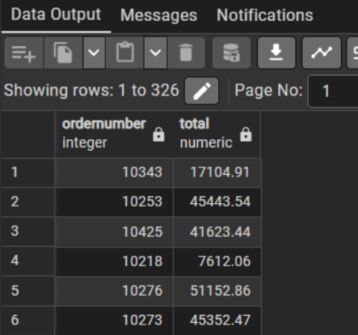
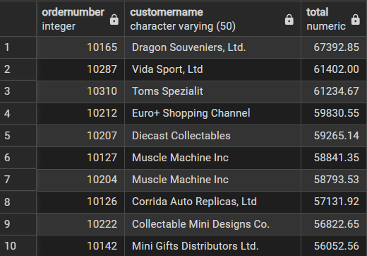
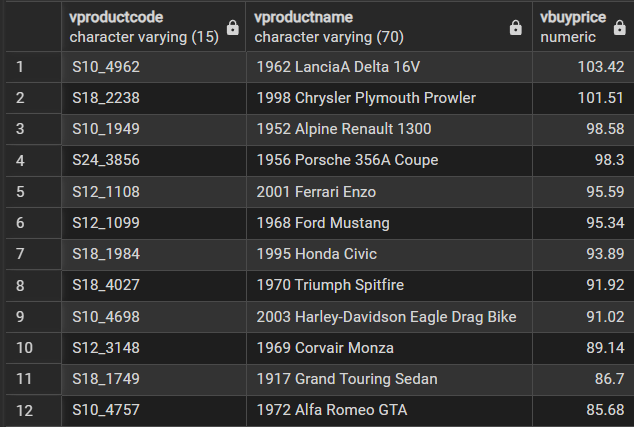
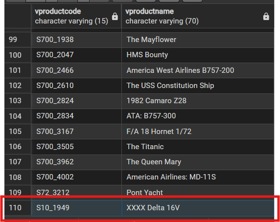
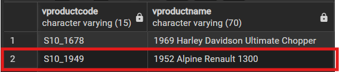

# Views
View คือ `virtual table`
- ไม่มีการเก็บข้อมูลจริงใน disk
- ข้อมูลถูกดึงมาจากคำสั่ง SELECT ของ table อื่น

## สิ่งที่ทำในหัวข้อนี้:
- เข้าใจว่า View เป็น **virtual table** (ไม่เก็บข้อมูลจริงลง disk)
- สร้าง View ด้วย `CREATE VIEW`
- แก้/แทนที่ View เดิมด้วย `CREATE OR REPLACE VIEW`
- สร้าง View ที่มีเงื่อนไขจาก subquery (เช่นสินค้าที่ราคาเหนือค่าเฉลี่ย)
- ทดลอง `UPDATE` ผ่าน View และสังเกตผลกับข้อมูลต้นทาง

## 1) Create view
- `salePerOrder` สรุปยอดขายรวมต่อ `orderNumber`
- เป็นการสร้าง `virtual bable` เก็บไว้ที่ `salePerOrder`

```sql
CREATE VIEW salePerOrder AS

SELECT
 orderNumber,
 SUM(quantityOrdered * priceEach) AS total
FROM orderDetails
GROUP BY orderNumber;
```
- output
- จะได้ `virtual bable` เดียวกับตอนที่ run query ปกติ
```sql
SELECT * FROM saleperorder;
```



## 2) Replace View
- REPLACE = แทนที่ View เดิม (ไม่ใช่ table)
- ถ้ามี View ชื่อ customerOrders อยู่แล้ว → ลบของเก่า แล้วสร้างใหม่ทันที
- ถ้ายังไม่มี → สร้างใหม่

- `customerOrders` รวมข้อมูล `orders + customers + orderDetails`
```sql
CREATE OR REPLACE VIEW customerOrders AS
SELECT orderNumber, customerName,
 SUM(quantityOrdered * priceEach) total
FROM orderDetails
INNER JOIN orders o USING (orderNumber)
INNER JOIN customers USING (customerNumber)
GROUP BY orderNumber, customerName;
```

- output
```sql
SELECT *
FROM customerOrders
ORDER BY total DESC;
```



## 3) Update view
- สร้าง`aboveAvgProducts` จากนั้นจะ update ด้วย `aboveProducts`
- ไม่สามารถ update ได้เพราะมีการใช้ ORDER by, aggregate
- สิ่งนี้เรียกว่า not automatically updatable
```sql
CREATE OR REPLACE VIEW aboveAvgProducts
(vproductCode,vproductName,vbuyPrice)
AS
 SELECT
 productCode,
 productName,
 buyPrice
 FROM
 products
 WHERE
 buyPrice > (
 SELECT AVG(buyPrice)
 FROM products)
 ORDER BY buyPrice DESC;
```

- output
- ได้ view เริ่มต้น
```sql
SELECT *
FROM aboveAvgProducts;
```


- แก้ปัญหาโดยการ update ด้วย `simple view` ที่ไม่มีการใช้ ORDER by, aggregate
- จะเห็นว่าเปลี่ยนชื่อ view จาก `aboveAvgProducts` -> `aboveProducts` เพราะจำนวน col ไม่เท่ากัน
- ถ้าอยาก REPLACE ให้ใช้ชื่อ `aboveAvgProducts` และข้อมูลต้องเหมือนเดิม แต่ในกรณีนี้จะเป็นการสร้างใหม่

```sql
CREATE OR REPLACE VIEW aboveProducts
 (vproductCode,vproductName)AS
SELECT productCode, productName
FROM products;
```
```sql
UPDATE aboveavgproducts
SET vproductName = 'XXXX Delta 16V'
WHERE vproductcode = 'S10_1949';
```
- output
- จะเห็นตัวที่ถูก update



- ข้อมูลเดิม

