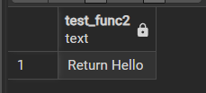

# Workshop
- จาก lab5 ที่ได้ขึ้นโปรเจคจาก `start_spring/demo` เอาตัวนั้นมาทำต่อ
- จะเขียนโค้ดและรันดูผลแค่ที่ไฟล์ `DemoApplication.java`
- ใน Workshop นี้ไปทดลองทั้งหมด 6 ตัวอย่างตามนี้

## 1) Anonymous block: Hello (v.1)
1. ที่ `postgres` ไปสร้าง CREATE ก่อน
```sql
CREATE OR REPLACE PROCEDURE test_proc()
LANGUAGE plpgsql
AS $$
BEGIN
    RAISE NOTICE 'Hello';
END;
$$;
```
2. ที่ไฟล์ `DemoApplication.java`
- ปิด qeury ของเก่าทิ้งแล้วเอาโค้ดนี้ไปวาง
```java
package com.example.demo;
import java.sql.*;
public class DemoApplication {
    public static void main(String[] args) {
        // PostgreSQL connection parameters
        String url = "jdbc:postgresql://localhost:5432/postgres";
        String username = "postgres";
        String password = "12345678";
        try (Connection conn = DriverManager.getConnection(url, username, password)) {

            try (CallableStatement call = conn.prepareCall("CALL test_proc()")) {

                call.execute(); // runs RAISE NOTICE 'Hello';

                // Read server messages generated by RAISE NOTICE
                SQLWarning warning = call.getWarnings(); // all RAISE messages arrive as warnings [web:45][web:48]
                while (warning != null) {
                    System.out.println("DB NOTICE: " + warning.getMessage());
                    warning = warning.getNextWarning();
                }
            }

        } catch (SQLException e) {
            System.err.println("Database error: " + e.getMessage());
            e.printStackTrace();
        }
    }
}
```
3. run ดูผลลัพธ์`.\mvnw clean compile exec:java`
- ได้ Hello มาแบบนี้คือถูก
```
[INFO] --- exec:3.1.0:java (default-cli) @ demo ---
DB NOTICE: Hello
[INFO] ------------------------------------------------------------------------
[INFO] BUILD SUCCESS
```

## 2) Function: return Hello
1. ที่ `postgres` ไปสร้าง CREATE ก่อน
```sql
CREATE OR REPLACE FUNCTION test_func2() RETURNS text 
LANGUAGE plpgsql AS $$ BEGIN RETURN 'Return Hello'; END; $$;
```
- จะ Retrn ออกมาแบบนี้

    `select * from test_func2()`

    

2. ที่ไฟล์ `DemoApplication.java`
```java
package com.example.demo;
import java.sql.*;
public class DemoApplication {
    public static void main(String[] args) {
        // PostgreSQL connection parameters
        String url = "jdbc:postgresql://localhost:5432/postgres";
        String username = "postgres";
        String password = "12345678";
        try (Connection conn = DriverManager.getConnection(url, username, password)) {

            try (PreparedStatement ps = conn.prepareStatement("SELECT test_func2()")) {

                try (ResultSet rs2 = ps.executeQuery()) {
                    if (rs2.next()) {
                        String result = rs2.getString(1);
                        System.out.println("Result: " + result); // prints Hello
                    }
                }
            }

        } catch (SQLException e) {
            System.err.println("Database error: " + e.getMessage());
            e.printStackTrace();
        }
    }
}
```
3. run ดูผลลัพธ์`.\mvnw clean compile exec:java`
- ได้ `Return Hello` ตามที่เขียนไว้ใน function `test_func2()`

```
[INFO] --- exec:3.1.0:java (default-cli) @ demo ---
Result: Return Hello
[INFO] ------------------------------------------------------------------------
[INFO] BUILD SUCCESS
```

## 3) Procedure: return gettotalorder (v.1)
- `IN` → รับค่าเข้า
- `OUT` → ส่งค่ากลับ
- `SELECT COUNT(*) INTO totalorder` → เอาผล SELECT ไปเก็บในตัวแปร

1. ที่ `postgres` ไปสร้าง CREATE ก่อน
```sql
DROP PROCEDURE IF EXISTS gettotalorder(IN in_shippeddate timestamp,  OUT totalorder integer);

CREATE OR REPLACE PROCEDURE gettotalorder(IN in_shippeddate timestamp ,OUT totalorder integer)
LANGUAGE plpgsql
AS $$
BEGIN
    SELECT COUNT(*)
    INTO totalorder
    FROM classicmodels.orders
 WHERE shippeddate <= in_shippeddate;
 
END;
$$;

--เรียกใช้งาน procedure ส่งวันที่เข้าไป, totalorder ให้เป็น NULL ไว้ก่อน
CALL gettotalorder('2003-03-31',totalorder => NULL);
```
2. ที่ไฟล์ `DemoApplication.java`
```java
package com.example.demo;
import java.sql.*;
public class DemoApplication {
    public static void main(String[] args) {
        // PostgreSQL connection parameters
        String url = "jdbc:postgresql://localhost:5432/postgres";
        String username = "postgres";
        String password = "12345678";
        try (Connection conn = DriverManager.getConnection(url, username, password)) {

            try (CallableStatement call = conn.prepareCall("CALL gettotalorder('2003-03-31',totalorder => NULL);")) {

                try (ResultSet rs3 = call.executeQuery()) {
                    if (rs3.next()) {
                        String result = rs3.getString(1);
                        System.out.println("Result2: " + result);
                    }
                }
            }

        } catch (SQLException e) {
            System.err.println("Database error: " + e.getMessage());
            e.printStackTrace();
        }
    }
}
```
3. run ดูผลลัพธ์`.\mvnw clean compile exec:java`
- ได้ `Result2: 14` ตรงกับใน `postgres` 

```
[INFO] --- exec:3.1.0:java (default-cli) @ demo ---
Result2: 14
```

### procedure vs function
| เรื่อง           | Function    | Procedure          |
| ---------------- | ----------- | ------------------ |
| ต้องคืนค่า       | ✅ ต้อง      | ❌ ไม่จำเป็น        |
| ใช้ RETURN       | ✅           | ไม่ใช้             |
| เรียกด้วย        | `SELECT`    | `CALL`             |
| เอาไปใช้ใน query | ✅ ได้       | ❌ ไม่ได้           |
| เหมาะกับ         | คำนวณ/หาค่า | ทำงาน/จัดการข้อมูล |


## 4) Procedure: return gettotalorder (v.2)
- ใช้ CREATE ตัวเดิมจาก 3)
- จะได้ output เหมือน 3) แต่ต่างกันที่ใน v.2
- จะส่งค่าให้ IN ผ่าน `DemoApplication.java`
1. ที่ไฟล์ `DemoApplication.java`
```java
package com.example.demo;
import java.sql.*;
public class DemoApplication {
    public static void main(String[] args) {
        // PostgreSQL connection parameters
        String url = "jdbc:postgresql://localhost:5432/postgres";
        String username = "postgres";
        String password = "12345678";
        try (Connection conn = DriverManager.getConnection(url, username, password)) {

            String sql3 = "CALL gettotalorder(?, ?);"; // Two placeholders: one IN, one OUT

            try (CallableStatement call = conn.prepareCall(sql3)) {
                // 1. Set the input (the timestamp)
                call.setTimestamp(1, java.sql.Timestamp.valueOf("2003-03-31 00:00:00"));

                // 2. Register the output parameter type
                call.registerOutParameter(2, java.sql.Types.INTEGER);

                // 3. Execute
                call.execute();

                // 4. Retrieve the OUT parameter value
                int result = call.getInt(2);
                System.out.println("Total Orders: " + result);

            } catch (SQLException e) {
                e.printStackTrace();
            }

        } catch (SQLException e) {
            System.err.println("Database error: " + e.getMessage());
            e.printStackTrace();
        }
    }
}

```
2. run ดูผลลัพธ์`.\mvnw clean compile exec:java`
- ได้ `Total Orders: 14` เท่ากับ 3)

```
[INFO] --- exec:3.1.0:java (default-cli) @ demo ---
Total Orders: 14
[INFO] ------------------------------------------------------------------------
[INFO] BUILD SUCCESS
```

## 5)Anonymous block: Hello (v.2)
- ได้ output เหมือน 1) แต่ต่างกันที่ไม่ได้เขียน CREATE ไว้ก่อนเหมือน 1)
- แต่จะเขียน `anonymous block` เป็น string ไว้
- พอตอน execute ก็จะส่ง string ไป execute

1. ที่ไฟล์ `DemoApplication.java`
```java
package com.example.demo;
import java.sql.*;
public class DemoApplication {
    public static void main(String[] args) {
        // PostgreSQL connection parameters
        String url = "jdbc:postgresql://localhost:5432/postgres";
        String username = "postgres";
        String password = "12345678";
        try (Connection conn = DriverManager.getConnection(url, username, password)) {

            String sql = """
                    DO $$
                    BEGIN
                     RAISE NOTICE 'Hello from anonymous block';
                    END;
                    $$;
                    """;

            try (Statement stmt = conn.createStatement()) {

                stmt.execute(sql);

                SQLWarning warning = stmt.getWarnings();
                while (warning != null) {
                    System.out.println("DB NOTICE: " + warning.getMessage());
                    warning = warning.getNextWarning();
                }
            }

        } catch (SQLException e) {
            System.err.println("Database error: " + e.getMessage());
            e.printStackTrace();
        }
    }
}
```
2. run ดูผลลัพธ์`.\mvnw clean compile exec:java`
- ได้แบบนี้คือถูกต้อง
```
[INFO] --- exec:3.1.0:java (default-cli) @ demo ---
DB NOTICE: Hello from anonymous block
[INFO] ------------------------------------------------------------------------
[INFO] BUILD SUCCESS
```

## 6) Execute string: The total
1. ที่ไฟล์ `DemoApplication.java`
```java
package com.example.demo;
import java.sql.*;
public class DemoApplication {
    public static void main(String[] args) {
        // PostgreSQL connection parameters
        String url = "jdbc:postgresql://localhost:5432/postgres";
        String username = "postgres";
        String password = "12345678";
        try (Connection conn = DriverManager.getConnection(url, username, password)) {

            String sql4 = """
                    DO $$
                    DECLARE
                     total integer; -- You must declare a variable to hold the math
                    BEGIN
                     total := 1 + 1;
                     RAISE NOTICE 'The total is: %', total;
                    END;
                    $$;
                    """;

            try (Statement stmt = conn.createStatement()) {

                stmt.execute(sql4);

                SQLWarning warning = stmt.getWarnings();
                while (warning != null) {
                    System.out.println("DB NOTICE2: " + warning.getMessage());
                    warning = warning.getNextWarning();
                }
            }

        } catch (SQLException e) {
            System.err.println("Database error: " + e.getMessage());
            e.printStackTrace();
        }
    }
}
```
2. run ดูผลลัพธ์`.\mvnw clean compile exec:java`
- ได้แบบนี้คือถูกต้อง
```
[INFO] --- exec:3.1.0:java (default-cli) @ demo ---
DB NOTICE2: The total is: 2
[INFO] ------------------------------------------------------------------------
[INFO] BUILD SUCCESS
```
