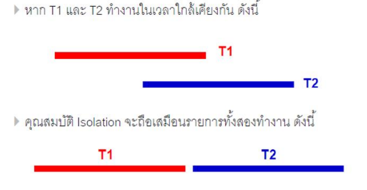

# Transection & Concurrency Control

## Transection
การทำ Transaction คือการรวมคำสั่งหลายคำสั่งให้เป็นงานเดียวกัน เพื่อควบคุมความถูกต้องของข้อมูลในฐานข้อมูล

- `COMMIT` ใช้ยืนยันการเปลี่ยนแปลงทั้งหมดใน Transaction ให้บันทึกลงฐานข้อมูลจริง
- `ROLLBACK` ใช้ยกเลิกการเปลี่ยนแปลงทั้งหมดใน Transaction และย้อนกลับไปยังสถานะก่อนเริ่ม 

## Concurrency Control
Concurrency Control เกิดขึ้นมาเพื่อแก้ปัญหา Concurrent Problem โดยในบทนี้เราจะแก้ปีญหาด้วย `Isolation Level`


```
Concurrency Control
     ↓
ใช้ Isolation Level เพื่อกำหนดพฤติกรรม
     ↓
Database ใช้ Locking Method เพื่อทำให้ Isolation Level นั้นเกิดขึ้นจริง
```

Concurrency Control เกิดขึ้นมาเพื่อแก้ปัญหา Concurrent Problem โดยในบทนี้เราจะแก้ปัญหาด้วย `Isolation Level`


## Concurrent Problem คืออะไร?
คือปีญหาที่เกิดขึ้นเมื่อมีหลาย transaction ทำงานพร้อมกัน (concurrently) แล้วเข้าถึงข้อมูลเดียวกันในเวลาใกล้เคียงกัน ทำให้ข้อมูลผิดพลาดหรือไม่สอดคล้องกัน

## ส่งผลให้เกิปัญหาดังนี้
| Problem                 | ความหมาย                                         |
| ----------------------- | ------------------------------------------------ |
| **Lost Update**         | transaction หนึ่งเขียนทับค่าของอีก transaction   |
| **Dirty Read**          | อ่านข้อมูลที่ยังไม่ commit                       |
| **Non-repeatable Read** | อ่าน row เดิม 2 ครั้งได้ค่าต่างกัน               |
| **Write Phantom**       | update/insert ทำให้ rule ของระบบผิด (write skew) |
| **Count Phantom**       | query เดิมแต่จำนวน row เปลี่ยน (insert/delete)   |
| **Incorrect Summary**   | SUM/AVG/COUNT ผิดเพราะมี update ระหว่างคำนวณ     |


## ส่งผลให้เกิดปัญหาดังนี้
- Lost Update – ค่าโดนเขียนทับโดยไม่ตั้งใจ
- Dirty Read – อ่านข้อมูลที่ยังไม่ commit
- Non-repeatable Read – อ่านรอบแรกกับรอบสองได้ค่าต่างกัน
- Write Phantom – มี row ใหม่โผล่จาก insert
- Count Phantom – มี Count เพิ่มขึ้นมาแบบงงๆ
- Incorrect Summary	– SUM / AVG / COUNT ผิดเพราะ concurrent update

## Isolation Level คืออะไร?
Isolation Level คือระดับการแยกการทำงานของแต่ละ transaction
กำหนดว่า transaction หนึ่ง `มองเห็น` การเปลี่ยนแปลงของอีก transaction ได้มากแค่ไหน
อยู่ในหลักการ ACID (ตัว I = Isolation)

| Isolation Level      | ป้องกันปัญหาอะไรได้บ้าง                                                              |
| -------------------- | ------------------------------------------------------------------------------------ |
| **Read Uncommitted** | แทบไม่ป้องกันอะไรเลย (Dirty Read ยังเกิดได้)                                         |
| **Read Committed**   | ป้องกัน **Dirty Read**                                                               |
| **Repeatable Read**  | ป้องกัน **Dirty Read**, **Non-repeatable Read**                                      |
| **Serializable**     | ป้องกัน **Lost Update, Dirty Read, Non-repeatable Read, Phantom, Incorrect Summary** |

## แนวทางในการเลือกใช้ Isolation Level
การเลือก Isolation Level ต้องดูจาก ความเข้มงวดของระบบ

| กรณีใช้งาน                           | Isolation Level                  |
| ------------------------------------ | -------------------------------- |
| ระบบ CRUD ทั่วไป                     | **READ COMMITTED** (ค่า default) |
| ต้องการ snapshot ของข้อมูลที่คงที่   | **REPEATABLE READ**              |
| ระบบการเงิน / ธุรกิจที่ผิดพลาดไม่ได้ | **SERIALIZABLE**                 |

## Locking Method คืออะไร
Locking Method คือวิธีที่ฐานข้อมูลใช้ ล็อกข้อมูล เพื่อป้องกันไม่ให้หลาย transaction แก้ไขข้อมูลเดียวกันพร้อมกันจนเกิด concurrent problem

แนวคิดหลัก `Transaction หนึ่งกำลังใช้ข้อมูล → transaction อื่นต้องรอ`

## ใน lab นี้เราทำอะไร
- ทดลองเคสของ `Read Committed` เพื่อสังเกตว่า
	- ป้องกัน `Dirty Read` ได้ (จะไม่เห็นข้อมูลที่อีก transaction ยังไม่ commit)
	- พบกรณีชนกันระหว่างการ insert (เช่น key ซ้ำ) ระหว่าง transaction
- ทดลองเคสของ `Repeatable Read` เพื่อยืนยันว่า
	- ค่า/ข้อมูลที่อ่านครั้งแรกใน transaction เดิมจะคงเดิมเมื่ออ่านซ้ำ
- ทดลองเคสของ `Serializable`
	- ทดลองโจทย์ `Write Skew (Predicate Write Conflict)` และพบว่า `Serializable` ป้องกันปัญหานี้ได้
	- สังเกต trade-off ของ `Serializable`: ปลอดภัยสูง แต่ช้าลง, ใช้ lock มากขึ้น, เสี่ยง deadlock/rollback มากขึ้น
- ทดลอง Lab `Shared Lock (S-lock)` และพบว่า
	- ฝั่ง T2 ที่พยายาม `INSERT` อาจติด `Deadlock`/ต้องรอ จนกว่า T1 จะ `COMMIT`
- ทดลอง Lab `Exclusive Lock (X-lock)` และพบว่า
	- transaction อื่นต้องรอให้ T1 `COMMIT` ก่อน
	- จึงจะสามารถ `SELECT` หรือ `INSERT` ต่อได้
