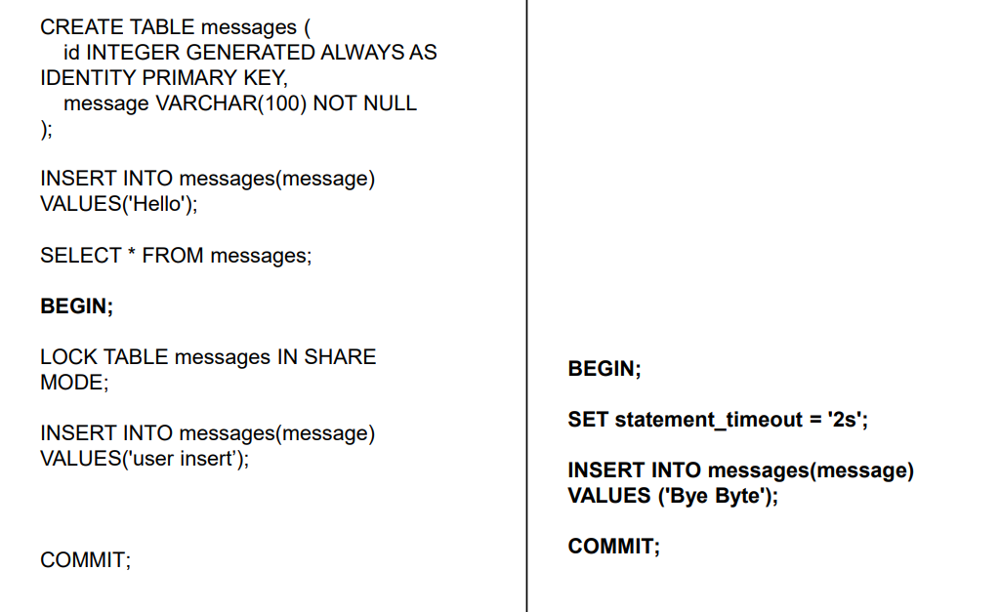
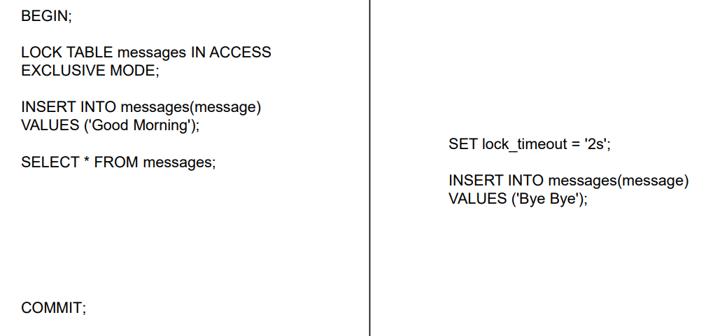

# Locking Method
มี 2 ประเภท
- `Shared Lock` (S-lock) lock ไม่ให้อีก transection แก้ไข แต่ให้อ่านได้
- `Exclusive Lock` (X-lock) lock ไม่ให้อีก transection ทำอะไรได้เลย

## Lock Level
| Level    | ล็อกอะไร |
| -------- | -------- |
| Row      | row      |
| Table    | table    |
| Database | database |

## Row Lock (update lock) ที่ใช้บ่อย
- `SELECT FOR UPDATE` ใช้ lock row สำหรับ update
- ผลคือ transaction อื่น update row นี้ไม่ได้

## Lab1: `Shared Lock` (S-lock)
- ทดลองทำตาม diagram นี้

### สรุปผลการทดลอง
- ที่ T1 สามารถ `INSERT` ได้ปกติ
- แต่ที่ T2 เมื่อสั่ง `INSERT` จะเกิด `Deadlock` ต้องให้ T1 COMMIT จึงจะ `INSERT` ต่อได้

## Lab2: `Exclusive Lock` (X-lock)
- ทดลองทำตาม diagram นี้

### สรุปผลการทดลอง
- เหมือน `S-lock` ที่ต้องให้ T1 COMMIT ก่อน
- ถึงจะ `SELECT`, `INSERT` ต่อได้
