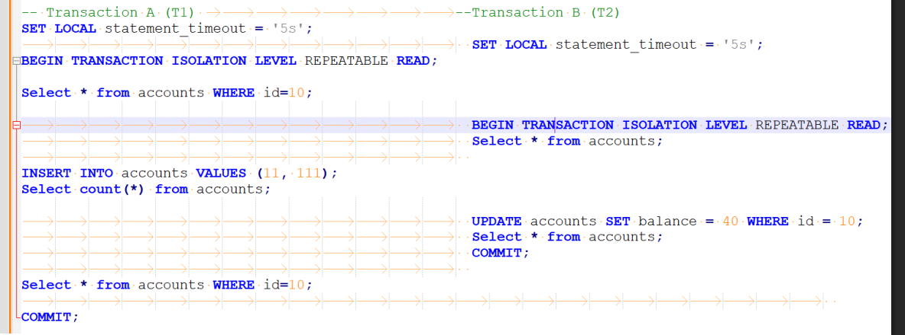
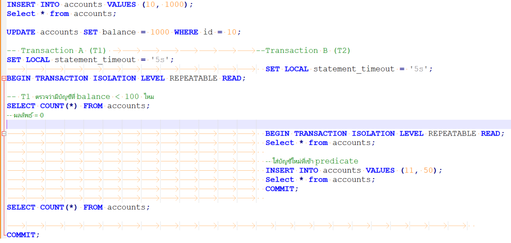
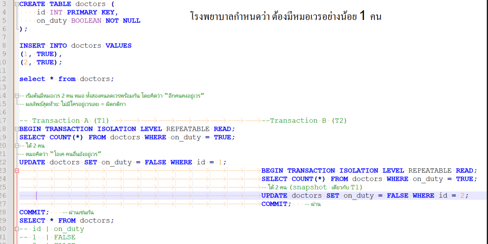

# Repeatable Read
- ข้อมูลที่ transaction อ่านครั้งแรก
- จะต้องเหมือนเดิมตลอด transaction

## Solve: Nonrepeatable Read Problem
- ทดลองทำตาม diagram นี้




### สรุปผลการทดลอง
- พบว่าเมื่อ insert ใน T1 จะทำให้ จำนวน row (count) เพิ่มขึ้นจาก 1 -> 2
- แต่ T2 ก็จะไม่เห็นการเปลี่ยนแปลงของ T1
- เมื่อ T1 อ่านข้อมูลซ้ำก็จะได้ (10, 1000) `เหมือนเดิมแม้ T2 จะ commit มาแล้วก็ตาม` 
    ```
     id | balance
    ----+---------
    10 |    1000
    11 |     111
    (2 rows)
    ```
- จึงสรุปว่า `Repeatable Read` แก้ปัญหา `Nonrepeatable Read` ได้จริง
- หลังจากที่ commit ทั้ง 2 ฝั่ง(จบ transactionทั้งคู่) ถึงจะเห็นข้อมูลที่แต่ละฝั่งได้ทำลงไป
    ```
    postgres=# Select * from accounts;
    id | balance
    ----+---------
    11 |     111  -> T1
    10 |      40  -> T2
    (2 rows)
    ```

## Solve: Count Phantom
- ทดลองทำตาม diagram นี้



### สรุปผลการทดลอง
- เพราะว่าต่าง Transection จะมองไม่เห็นกันอยู่แล้วถ้ายังไม่ COMMIT จึงป้องกัน `Count Phantom` ได้จริง 
- เมื่อดู count ก็ยังเป็น 1 แม้ T2 จะทำการ insert
    ```
    postgres=*# Select count(*) from accounts;
    count
    -------
        1
    (1 row)
    ```

## Write Skew (Predicate Write Conflict) Problem
- `Write Phantom` หรือ `Write Skew` เกิดเมื่อ
    - transaction 2 ตัว
    - อ่านข้อมูลเดียวกัน
    - แล้ว update คนละ row
    - แต่ทำให้ business rule ผิด

- ทดลองทำตาม diagram นี้
- business rule: ต้องมีหมอ 1 คนอยู่เวร



### สรุปผลการทดลอง
- หมอทั้ง 2 คนไม่อยู่เวร จึงผิด business rule
    ```
    postgres=# Select * from doctors;
    id | on_duty
    ----+---------
    1 | f
    2 | f
    (2 rows)
    ```
