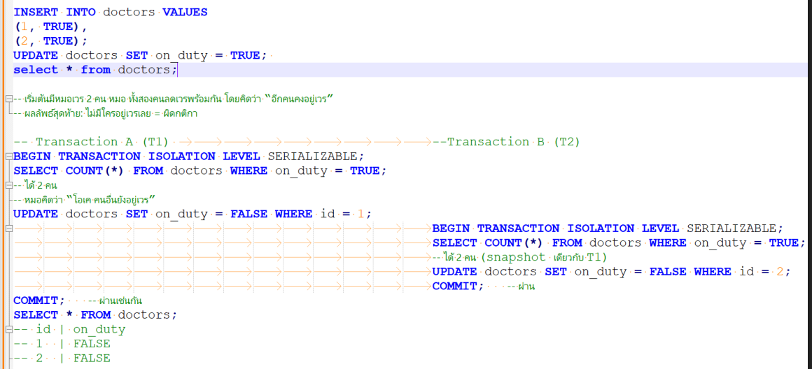

# Serializable
- ถึงแม้ transaction จะรันพร้อมกัน แต่ผลลัพธ์จะ เหมือนกับรันทีละตัว
- ถึงแม้จะ ปลอดภัยที่สุด แต่ก็มีข้อเสีย
    - ช้าลง (performance ต่ำ)
    - lock เยอะ
    - deadlock เกิดง่าย
    - transaction อาจถูก rollback เพื่อรักษา serializable

### Solve: Write Skew (Predicate Write Conflict)
- ทดลองทำตาม diagram นี้




### สรุปผลการทดลอง
- `Serializable` แก้ปัญหา `Write Skew` ได้จริง
- ทั้งT1 และ T2 จะสามารถ update ได้ แต่เมื่อ T2 COMMIT
- จากนั้นที่ T1 COMMIT จะพบว่าไม่สามารถ COMMIT ได้ และจะจบ Transection ทันที
    ```
    postgres=*# UPDATE doctors SET on_duty = FALSE WHERE id = 1;
    UPDATE 1
    postgres=*# COMMIT;
    ERROR:  could not serialize access due to read/write dependencies among transactions
    DETAIL:  Reason code: Canceled on identification as a pivot, during commit attempt.
    HINT:  The transaction might succeed if retried.
    postgres=#
    ```
- เมื่อมา `Select * from doctors;` จะบพว่าข้อมูลจะถูก update เฉพาะข้อมูลที่ไม่ทำให้ผิด `business rule`
    ```postgres=# Select * from doctors;
    id | on_duty
    ----+---------
    1 | t
    2 | f
    (2 rows)
    ```