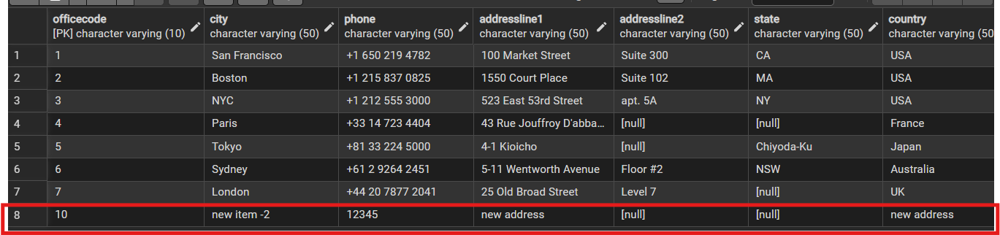

# Transaction

## ตัวอย่างการทำงาน
- step 1: เริ่ม Transaction
```sql
BEGIN;
```

- step 2: run INSERT
```sql
INSERT INTO offices
    (officecode, city, phone, addressLine1, country, postalcode, territory, officelocation)
VALUES
    (10, 'new item -2', '12345', 'new address', 
	'new address', 'new-postcode', 'new-t',
	'0101000020E61000003A58FFE730E34240D3DA34B6D79A5EC0');
```

- stpe 3: ดู output จะเห็นว่ามี row ที่เรา insert ไป
```sql
SELECT * FROM offices;
```



- step 4: เลือกคำสั่งปิด Transaction ตามต้องการ
```sql
ROLLBACK; -- ยกเลิกการเปลี่ยนแปลงทั้งหมดใน Transaction นี้
COMMIT;   -- ยืนยันการเปลี่ยนแปลงทั้งหมดใน Transaction นี้
```

## Code เต็ม
```sql
BEGIN;

INSERT INTO offices
    (officecode, city, phone, addressLine1, country, postalcode, territory, officelocation)
VALUES
    (10, 'new item -2', '12345', 'new address', 
	'new address', 'new-postcode', 'new-t',
	'0101000020E61000003A58FFE730E34240D3DA34B6D79A5EC0');

SELECT * FROM offices;

ROLLBACK;
-- COMMIT;
```

## ACID
ACID คือคุณสมบัติสำคัญของ Transaction ที่ช่วยให้ข้อมูลมีความน่าเชื่อถือและถูกต้อง

- **Atomicity**: Transaction ต้องสำเร็จทั้งหมดหรือไม่สำเร็จเลย ไม่มีสถานะครึ่งกลาง
- **Consistency**: หลังจบ Transaction ข้อมูลต้องยังคงถูกต้องตามกฎและเงื่อนไขของระบบ
- **Isolation**: Transaction ที่ทำงานพร้อมกันต้องไม่รบกวนกันจนเกิดข้อมูลผิดพลาด
- **Durability**: เมื่อ `COMMIT` แล้ว ข้อมูลต้องถูกบันทึกถาวร แม้ระบบล่มหลังจากนั้น
